# CMTAT Solana

This document contains the guidelines to deploy a CMTAT compliant token on [Solana](https://solana.com).

**CMTAT**

- The CMTA Standard Token for Securities (CMTAT) is an open standard for smart contracts designed specifically for the tokenization of financial instruments such as equity, debt and structured products and other transferable securities. 
- CMTAT is blockchain agnostic in that it defines a set of functionalities that a security token should implement. 

CMTAT specifications are available on CMTA website: [cmta.ch/standards/cmta-token-cmtat](https://cmta.ch/standards/cmta-token-cmtat)

**Solana**

- Solana is a high-performance, Layer 1 blockchain optimized for finance and internet capital markets. 
- Solana enables parallel execution and deterministic finality natively on its base layer, ensuring high throughput without sacrificing user experience or composability.

See [What is Solana](https://solana.com/learn/what-is-solana), [Solana - tokenized equities](https://solana.com/tokenized-equities)

[TOC]

## Solana introduction

Tokens on Solana are digital assets that represent ownership over diverse categories of assets. Tokenization enables the digitalization of property rights. 

Tokens on Solana are referred to as SPL ([Solana Program Library](https://github.com/solana-program)) Tokens.

### Solana Token

This program defines a common implementation for Fungible and Non Fungible tokens.

#### Key Points

- [Token Programs](https://solana.com/docs/tokens#token-program) contain all instruction logic for interacting with tokens on the network (both fungible and non-fungible).
- A [Mint Account](https://solana.com/docs/tokens#mint-account) represents a specific token and stores global metadata about the token such as the total supply and mint authority (address authorized to create new units of a token).
- A [Token Account](https://solana.com/docs/tokens#token-account) tracks individual ownership of tokens for a specific mint account for a specific owner.
- An [Associated Token Account](https://solana.com/docs/tokens#associated-token-account) is a Token Account created with an address derived from the owner and mint account addresses.

#### Features

- Create a Token Mint – Initialize a new SPL Token mint.
- Create a Token Account – Open an account to hold SPL tokens.
- Mint Tokens – Generate new units of the token and assign them to an account.
- Transfer Tokens – Send tokens between accounts securely.
- Approve Delegate – Grant another account permission to manage tokens on behalf of the owner.
- Revoke Delegate – Remove delegate permissions from an account.
- Set Authority – Change the authority for a mint or token account (e.g., minting, freezing, account management).
- Burn Tokens – Permanently destroy tokens, reducing supply.
- Sync Native – Wrap native SOL into wrapped SOL (WSOL) for token program compatibility.
- Close Token Account – Close an SPL Token account and reclaim its SOL rent.
- Freeze Account – Halt activity on a token account.
- Thaw Account – Reactivate a previously frozen token account.

### Solana Extension (Token-2022)

The Token-2022 Program, also known as Token Extensions, is a superset of the functionality provided by the [Token Program](https://www.solana-program.com/docs/token).

Token extensions introduce a new set of ways to extend the normal token functionality. 

- The original Token program brought the basic capabilities of minting, transferring and freezing tokens. 
- The Token Extensions program includes the same features, but comes come with additional features such as permanent delegate, custom transfer logic, extended metadata, and much more.
- The [Token Extensions program](https://spl.solana.com/token-2022) has the programID `TokenzQdBNbLqP5VEhdkAS6EPFLC1PHnBqCXEpPxuEb` and is a superset of the original functionality provided by the [Token Program](https://spl.solana.com/token) at `TokenkegQfeZyiNwAJbNbGKPFXCWuBvf9Ss623VQ5DA`.

The full list of available extensions on the Solana Token-2022 program is below:

#### Mint extensions

Mint extensions currently include:

- transfer fees
- closing mint
- interest-bearing tokens
- non-transferable tokens
- permanent delegate
- transfer hook
- metadata pointer
- metadata
- group pointer
- group
- group member pointer
- group member
- scaled UI amount
- pausable
- confidential transfers
- confidential mint-burn

#### Account extensions

Account extensions currently include:

- memo required on incoming transfers
- immutable ownership
- default account state
- CPI guard

## CMTAT - Solana Requirements

### Comparison tab

This section contains four tables to indicate if a Solana token feature or an extension is required or optional to align with the by CMTAT framework's required or optional features.

#### CMTAT framework -> Solana token (Basic/Extension)

In the below table, the CMTAT framework required features are mapped to Solana token features.

| **CMTAT framework mandatory functionalities** | **Solana token basic features**                              | **Solana Extension**                                         | **CMTAT Solidity corresponding features**                    |
| --------------------------------------------- | ------------------------------------------------------------ | ------------------------------------------------------------ | ------------------------------------------------------------ |
| Know total supply                             | Query the [Mint Account](https://solana.com/docs/tokens/basics/create-mint) | &#x2612;                                                     | ERC20 `totalSupply`                                          |
| Know balance                                  | Query the [Token Account](https://solana.com/docs/tokens/basics/create-token-account) | &#x2612;                                                     | ERC20 `balanceOf`                                            |
| Transfer tokens                               | [Transfer  tokens](https://solana.com/docs/tokens/basics/transfer-tokens) | &#x2612;                                                     | ERC20 `transfer`                                             |
| Create tokens (mint)                          | [Mint tokens](https://solana.com/docs/tokens/basics/mint-tokens) | &#x2612;                                                     | `Mint/batchMint`                                             |
| Cancel tokens (force burn)                    | &#x2612;                                                     | [Permanent Delegate](https://www.solana-program.com/docs/token-2022/extensions#permanent-delegate) | `burn/batchBurn`                                             |
| Pause tokens                                  | &#x2612;                                                     | [Pausable](https://www.solana-program.com/docs/token-2022/extensions#pausable) (*pause*) <br />(*Nb. During this time, it is normally not possible to 		transfer, mint or burn tokens.)* 		 		*To enable mint and burn during pause a transfer hook must be 		used. See here.* | Pause <br />(*Nb. With CMTAT Solidity it is still possible to burn and mint while transfers are paused.)* |
| Unpause tokens                                | &#x2612;                                                     | [Pausable](https://www.solana-program.com/docs/token-2022/extensions#pausable) (*resume*) | `unpause`                                                    |
| Deactivate contract                           | &#x2612;                                                     | [Mint Close Authority](https://www.solana-program.com/docs/token-2022/extensions#mint-close-authority) 	<br />(Burn all tokens, close Mint Account, eventually revoke authorities) | `deactivateContract`                                         |
| Freeze                                        | [Freeze  Account](https://solana.com/docs/tokens/basics/freeze-account) | &#x2612;                                                     | `setAddressFrozen` (previously `freeze`)                     |
| Unfreeze                                      | [Thaw Account](https://solana.com/docs/tokens/basics/thaw-account) | &#x2612;                                                     | `setAddressFrozen` (previously `unfreeze`)                   |
| Name attribute                                | &#x2612;                                                     | [Metadata](https://www.solana-program.com/docs/token-2022/extensions#metadata), [Metadata Pointer](https://www.solana-program.com/docs/token-2022/extensions#metadata-pointer) | ERC20 `name` attribute                                       |
| Ticker symbol attribute                       | &#x2612;                                                     | [Metadata](https://www.solana-program.com/docs/token-2022/extensions#metadata), [Metadata Pointer](https://www.solana-program.com/docs/token-2022/extensions#metadata-pointer) | ERC20 `symbol` attribute                                     |
| Token ID attribute                            | &#x2612;                                                     | [Metadata](https://www.solana-program.com/docs/token-2022/extensions#metadata), [Metadata Pointer](https://www.solana-program.com/docs/token-2022/extensions#metadata-pointer) | `tokenId`                                                    |
| Reference to legally required documentation   | &#x2612;                                                     | [Metadata](https://www.solana-program.com/docs/token-2022/extensions#metadata), [Metadata Pointer](https://www.solana-program.com/docs/token-2022/extensions#metadata-pointer) | `terms`                                                      |


#### CMTAT extended -> Solana token (Basic/Extension)

In the below table, the CMTAT framework optional features are mapped to Solana token features.

| CMTAT Functionalities      | Solana token basic features                                  | Solana Extension                                             | **CMTAT Solidity corresponding features**      |
| :------------------------- | :----------------------------------------------------------- | :----------------------------------------------------------- | ---------------------------------------------- |
| force Transfer             | &#x2612;                                                     | [Permanent Delegate](https://www.solana-program.com/docs/token-2022/extensions#permanent-delegate) | `forcedTransfer`                               |
| freeze partial token       | &#x2612;                                                     | &#x2612;                                                     | `freezePartialTokens`/`unfreezePartialTokens`  |
| Whitelisting               | &#x2612;                                                     | [Default Account State](https://www.solana-program.com/docs/token-2022/extensions#default-account-state) | CMTAT Allowlist / CMTAT with rule whitelist    |
| RuleEngine / transfer hook | &#x2612;                                                     | [Transfer Hook](https://www.solana-program.com/docs/token-2022/extensions#transfer-hook)<br /> (not compatible with Confidential Transfer) | CMTAT with RuleEngine                          |
| On-chain snapshot          | &#x2612;                                                     | &#x2612;                                                     | SnapshotEngine or dedicated deployment version |
| Upgradibility              | N/A                                                          | N/A                                                          | CMTAT Upgradeable version                      |
| Feepayer/gasless           | N/A<br />See [Sponsoring Solana transactions - Coinbase Developer Documentation](https://docs.cdp.coinbase.com/server-wallets/v2/solana-features/sponsor-transactions) <br />It is managed at the transaction level, no link with the token. | N/A                                                          | CMTAT with ERC-2771 module                     |


#### Solana token basic -> CMTAT

In the below table, the Solana token basic features are mapped to the CMTAT framework.

| Solana  Token features                                       | Description                                                  | Solana CMTAT Required | CMTAT Required | CMTAT optional | CMTAT corresponding features          | Note                                                 |
| :----------------------------------------------------------- | :----------------------------------------------------------- | :-------------------- | :------------- | :------------- | :------------------------------------ | :--------------------------------------------------- |
| [Create a Token Mint](https://solana.com/docs/tokens/basics/create-mint) | A mint account uniquely represents a token on Solana and stores its global metadata. | &#x2611;              | N/A            | N/A            | N/A                                   | Correspond to deploy the smart contract on EVM chain |
| [Create a Token Account](https://solana.com/docs/tokens/basics/create-token-account) | A token account stores your balance of a specific token.     | &#x2611;              | N/A            | N/A            | N/A                                   | No relevant for EVM based blockchain                 |
| [Mint Tokens](https://solana.com/docs/tokens/basics/mint-tokens) | Minting creates new units of a token using the `MintTo` instruction. | &#x2611;              | &#x2611;       | &#x2612;       | mint/batchMint                        |                                                      |
| [Transfer Tokens](https://solana.com/docs/tokens/basics/transfer-tokens) | Token transfers move tokens between token accounts of the same mint. | &#x2611;              | &#x2611;       | &#x2612;       | ERC20 transfer                        |                                                      |
| [Approve Delegate](https://solana.com/docs/tokens/basics/approve-delegate) | The `ApproveChecked` instruction grants another account (the delegate) permission to transfer a specific amount of tokens from your token account. | &#x2611;              | &#x2611;       | &#x2612;       | ERC-20 approve                        |                                                      |
| [Revoke Delegate](https://solana.com/docs/tokens/basics/revoke-delegate) | The `Revoke` instruction removes all transfer permissions from the currently approved delegate. | &#x2611;              | &#x2611;       | &#x2612;       | ERC-20 approve                        |                                                      |
| [Set Authority](https://solana.com/docs/tokens/basics/set-authority) | The `SetAuthority` instruction changes or revokes authorities on mints and token accounts. | &#x2611;              | &#x2611;       | &#x2612;       | `RBAC system` `grantRole`             |                                                      |
| [Burn Tokens](https://solana.com/docs/tokens/basics/burn-tokens) | The `BurnChecked` instruction permanently destroys tokens by reducing the balance in a token account. | &#x2611;              | &#x2612;       | &#x2611;       | `burnFrom`                            |                                                      |
| [Sync Native](https://solana.com/docs/tokens/basics/sync-native) | The `SyncNative` instruction synchronizes a wrapped SOL (WSOL) token account balance with the actual SOL (lamports) stored in it. | &#x2612;              | &#x2612;       | &#x2612;       | &#x2612;                              |                                                      |
| [Close Token Account](https://solana.com/docs/tokens/basics/close-account) | The `CloseAccount` instruction permanently closes a token account and transfers all remaining SOL (rent) to a specified destination account. | &#x2611;              | &#x2612;       | &#x2612;       | &#x2612;                              | Solana specific features (but relevant to implement) |
| [Freeze Account](https://solana.com/docs/tokens/basics/freeze-account) | The `FreezeAccount` instruction prevents all token transfers or token burns from a specific token account. | &#x2611;              | &#x2611;       | &#x2612;       | `setAddressFrozen`(prev. `freeze` )   |                                                      |
| [Thaw Account](https://solana.com/docs/tokens/basics/thaw-account) | The `ThawAccount` instruction reverses a freeze, restoring full functionality to a previously frozen token account. | &#x2611;              | &#x2611;       | &#x2612;       | `setAddressFrozen`(prev. `unfreeze` ) |                                                      |

#### Solana extensions -> CMTAT

In the below table, the Solana extension features are mapped to the CMTAT framework.

| Solana Extension                                             | Description                                                  | CMTAT Required (Core features) | CMTAT optional | CMTAT Solidity corresponding features                        |
| :----------------------------------------------------------- | :----------------------------------------------------------- | :----------------------------- | :------------- | :----------------------------------------------------------- |
| [Mint Close Authority](https://www.solana-program.com/docs/token-2022/extensions#mint-close-authority) | Close mint account                                           | &#x2611;                       | &#x2612;       | `deactivateContract`                                         |
| [Transfer Fees](https://www.solana-program.com/docs/token-2022/extensions#transfer-fees) | Transferring tokens with a transfer fee                      | &#x2612;                       | &#x2612;       | &#x2612;                                                     |
| [Default Account State](https://www.solana-program.com/docs/token-2022/extensions#default-account-state) | Force all new token accounts to be frozen.                   | &#x2612;                       | &#x2611;       | CMTAT Allowlist / CMTAT with rule whitelist                  |
| [Immutable Owner](https://www.solana-program.com/docs/token-2022/extensions#immutable-owner) | Impossible to reassign ownership of an account.              | &#x2612;                       | &#x2612;       | &#x2612;                                                     |
| [Non-Transferable Tokens](https://www.solana-program.com/docs/token-2022/extensions#non-transferable-tokens) | Allows for "soul-bound" tokens that cannot be moved to any other entity. | &#x2612;                       | &#x2612;       | &#x2612;                                                     |
| [Required Memo on Transfer](https://www.solana-program.com/docs/token-2022/extensions#required-memo-on-transfer) | Enforces that all incoming transfers must have an accompanying memo instruction right before the transfer instruction. | &#x2612;                       | &#x2611;       | CMTAT ERC-1363                                               |
| [Interest-Bearing Tokens](https://www.solana-program.com/docs/token-2022/extensions#interest-bearing-tokens) | Using the `InterestBearingMint` extension and the `amount_to_ui_amount` instruction, you can set an interest rate on your token and fetch its amount with interest at any time. | &#x2612;                       | &#x2612;       | &#x2612;                                                     |
| [Permanent Delegate](https://www.solana-program.com/docs/token-2022/extensions#permanent-delegate) | Allows to specify a permanent account delegate for a mint. This authority can burn or transfer any amount of tokens. | &#x2612;                       | &#x2611;       | Forced transfer                                              |
| [CPI Guard](https://www.solana-program.com/docs/token-2022/extensions#cpi-guard) | CPI Guard is an extension that prohibits certain actions inside cross-program invocations. | &#x2612;                       | &#x2612;       | N/A<br />(Solana specific extension)                         |
| [Transfer Hook](https://www.solana-program.com/docs/token-2022/extensions#transfer-hook) | The Transfer Hook Interface is designed to allow token creators to "hook" additional functionality into token transfers. | &#x2612;                       | &#x2611;       | CMTAT with RuleEngine                                        |
| [Metadata Pointer](https://www.solana-program.com/docs/token-2022/extensions#metadata-pointer) | Allows a token creator to designate an address that describes the canonical metadata. | &#x2611;                       | &#x2612;       | N/A                                                          |
| [Metadata](https://www.solana-program.com/docs/token-2022/extensions#metadata) | Allows a mint creator to include their token's metadata directly in the mint account. | &#x2611;                       | &#x2612;       | ERC20 name & symbol terms attributes (uri, hash)             |
| [Group Pointer](https://www.solana-program.com/docs/token-2022/extensions#group-pointer) | Allows a token creator to designate a group account that describes the mint. | &#x2612;                       | &#x2612;       | &#x2612;                                                     |
| [Group](https://www.solana-program.com/docs/token-2022/extensions#group) | Token-2022 supports grouping of tokens through the group extension. | &#x2612;                       | &#x2612;       | &#x2612;                                                     |
| [Member Pointer](https://www.solana-program.com/docs/token-2022/extensions#member-pointer) | The member pointer allows a token creator to designate a member account that describes the mint. | &#x2612;                       | &#x2612;       | &#x2612;                                                     |
| [Member](https://www.solana-program.com/docs/token-2022/extensions#member) | The configurations for a member (group address and the member's number) mcan be stored directly in the mint itself. | &#x2612;                       | &#x2612;       | &#x2612;                                                     |
| [Pausable](https://www.solana-program.com/docs/token-2022/extensions#pausable) | "Pause" all activity. During this time, it is not possible transfer, mint, or burn tokens. | &#x2611;                       | &#x2612;       | `pause`<br />With CMTAT Solidity, it is possible to burn and mint while transfers are paused. |
| [Scaled UI Amount](https://www.solana-program.com/docs/token-2022/extensions#scaled-ui-amount) | Change how the UI amount of tokens are represented           | &#x2612;                       | &#x2612;       | &#x2612;                                                     |

 


## Schema

### Features


#### Base

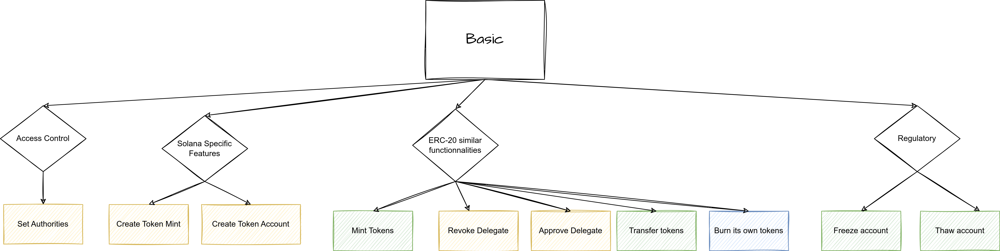

#### Extensions

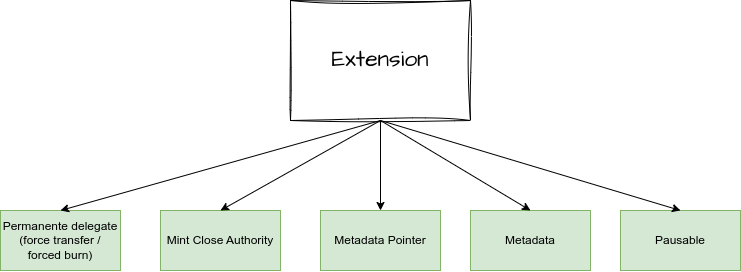

### Access Control

Here is a schema representing the different authorities:

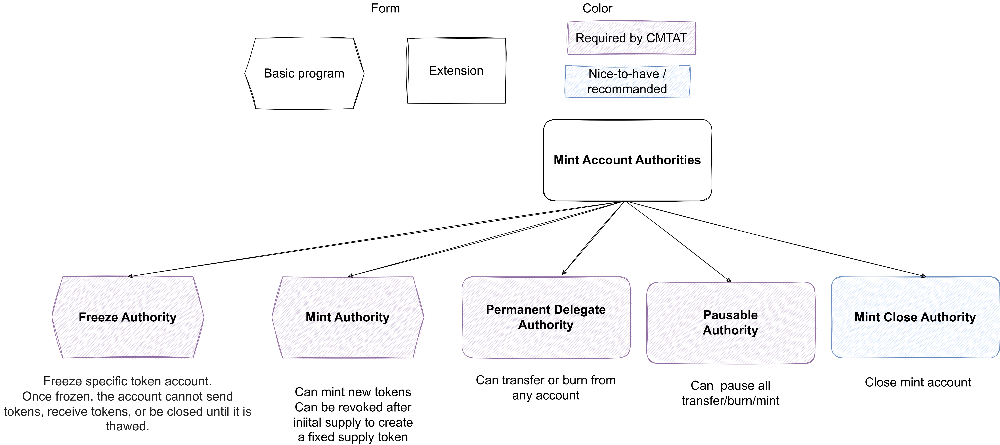 

## Main difference with EVM Solidity version

The CMTAT version for Ethereum and EVM-compatible blockchains is also available on GitHub [CMTA/CMTAT](https://github.com/CMTA/CMTAT).

**burn / transfer**

- With Solana, there is no difference between a regular transfer and a forced transfer, while on Ethereum it is two distinct functions. Same applies to a force burn.
  - Nevertheless, the signer of the transaction will be different if it is a forced transfer (delegate authority) or a regular transfer (token holder signer).
- Forced transfer is an optional feature of CMTAT. While the EVM version allows to only include the force burn, with Solana, it is not possible to include the force burn without the force transfer.
  - It is possible to separate force burn from force transfer if the permanent delegate is itself a smart contract that would only allow for one of the two options. 


- Contrary to the Solidity version, token holder can burn by default their own tokens.

**Access control**

- With the Solidity version, you can have a super admin which delegates several tasks to different addresses through different roles, for example the minter role to mint tokens.
- With Solana, you can also delegate roles, but it is not possible to delegate them while keeping a super admin.

Note: Similar to forced transfer above, if the role authorities are themselves smart contracts you can create complex control structures with multisigs, admin accounts etc. In order to have a super admin, you can designate all roles to one smart contract which then has its own rules as to who has authority over which role.

**Mint/burn while pause**

- With Ethereum, you can still burn and mint tokens while pausing regular transfers.
- This is not the case with Solana where the pause will also apply to mint and burn operations in addition to regular transfers.

Note: In order to enable this, you can use a [transfer hook](https://www.solana-program.com/docs/token-2022/extensions#transfer-hook) that is set to a program that just fails every transfer. This way you retain all other administrative features but prevent anyone from transferring tokens.

## CMTAT Deployment Guide (Token-2022)

This guide includes the deployment of a token on Solana which respects the CMTAT specification and contains the following features

- Mint tokens
- Freeze/unfreeze accounts
- Burn and forced transfer (Permanent Delegate)
- Pause/resume token activity
- Token information
  - Token name and Symbol
  - On-chain metadata with custom fields (`termsHash`, jurisdiction, issuer)

- Deactivate the token
  - close mint

All the operations have been made on a Linux machine through the SPL command line on a local Solana blockchain

### Set up

#### Environment variable

To simplify command, different values are stored in the current bash session environment.

| **Variable**         | Description                                          | Value                                                        |
| :------------------- | :--------------------------------------------------- | ------------------------------------------------------------ |
| ADMIN_SOLANA_KEYPAIR | Path to the JSON file containing the admin keypair   | Public Address<br />`Annh1c8T1nLKqU1dNNm7xUho7H6hU9KV6JE9THndHEfj` |
| USER_SOLANA_KEYPAIR  | Path to the JSON file containing the user keypair    | Public address<br />`9Grr8jKaZUji1VGj3uBBE3vWBmRbf48CGUchAUfxrqk` |
| TOKEN_MINT           | Token address                                        | `JA6iL96LYav6GaMS1NnrZRTYA98PjfyQyu9DBwxdb2b2`               |
| ADMIN_TOKEN_ACCOUNT  | Admin Token account for the corresponding TOKEN_MINT | `ApXcDVWCXhPgfAmUYqQ85JcYmyxqecqDPKXPz8B2fjqK`               |
| USER_TOKEN_ACCOUNT   | User Token account for the corresponding TOKEN_MINT  | `diZa8NKEJ7wTf31meXA9X2pyQnBsTnV4jsYUmwfFAK1`                |

#### Run a local blockchain

```bash
solana-test-validator
```


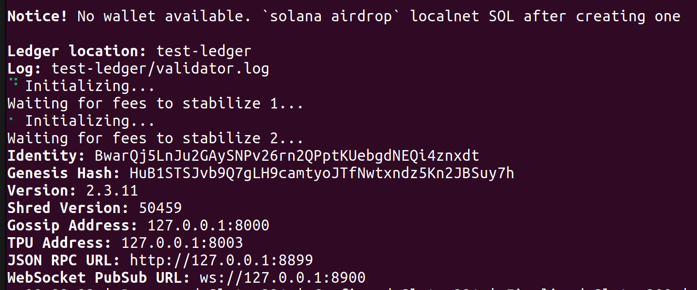

#### Generate Admin Keypair

This keypair will act as the mint authority, freeze authority, pause authority, and update authority for your token.

> **Important:** The following command generates a new keypair for demonstration/example purposes.
> Do not use this keypair in production, as it is stored locally and not secured in a hardware wallet or secure key management system. For production, use a **secure key management solution** (e.g., hardware wallet, secure enclave, or custodian service).

```bash
# Generate a new Solana keypair for admin authority 
solana-keygen new -o test_admin.json 
# Export environment variable to use this keypair with SPL commands export 
export ADMIN_SOLANA_KEYPAIR=test_admin.json 
# Generate a new Solana keypair for a test user 
solana-keygen new -o test_user.json 
# Export environment variable to use this keypair with SPL commands 
export USER_SOLANA_KEYPAIR=test_user.json

# Change the signer in the config for the admin solana config 
solana config set -k $ADMIN_SOLANA_KEYPAIR
# Check configuration
solana config get
# Check default address
solana address --keypair $ADMIN_SOLANA_KEYPAIR
solana address

#Change url to local blockchain/validator
solana config set --url http://127.0.0.1:8899

#Aidrop SOL token to pay gas fees locally
solana airdrop 1000 $USER_SOLANA_KEYPAIR
solana airdrop 1000 $ADMIN_SOLANA_KEYPAIR
```

- `test_admin.json` is the local file storing the token admin keypair.
- `test_user.json` is the local file storing the test user (token holder) keypair.
- `SOLANA_KEYPAIR` environment variable allows CLI tools (like `spl-token`) to reference it automatically.

------

### Create Token with the required extensions

```bash
spl-token create-token \  --program-id TokenzQdBNbLqP5VEhdkAS6EPFLC1PHnBqCXEpPxuEb \  --decimals  <decimals>\  --mint-authority < Solana Keypair> \  --enable-permanent-delegate \  --enable-pause \  --enable-close \  --enable-metadata  --enable-freeze
```

**Note**

-  `TokenzQdBNbLqP5VEhdkAS6EPFLC1PHnBqCXEpPxuEb` is the programId of the Token Extensions program. See [Getting Started with Token Extensions](https://solana.com/en/developers/guides/token-extensions/getting-started) 
- `decimals`: as part of CMTA specification, decimal numbers must be set to zero (which means that the tokens admit no fractional parts), unless the law governing the tokenized security allows the transfer of fractions.
- You can decide to use a different keypair address for the `mint-authority`
  - At deployment, the command-line does not allow you to set a different key for the other authorities (`freeze`, `pause`, `delegate`)

#### Example

**Command**

```bash
spl-token create-token   --program-id TokenzQdBNbLqP5VEhdkAS6EPFLC1PHnBqCXEpPxuEb   --decimals  0  --mint-authority $ADMIN_SOLANA_KEYPAIR   --enable-permanent-delegate   --enable-pause   --enable-close   --enable-metadata --enable-freeze
```

**Result**

> Creating token JA6iL96LYav6GaMS1NnrZRTYA98PjfyQyu9DBwxdb2b2 under program TokenzQdBNbLqP5VEhdkAS6EPFLC1PHnBqCXEpPxuEb
> To initialize metadata inside the mint, please run `spl-token initialize-metadata JA6iL96LYav6GaMS1NnrZRTYA98PjfyQyu9DBwxdb2b2 <YOUR_TOKEN_NAME> <YOUR_TOKEN_SYMBOL> <YOUR_TOKEN_URI>`, and sign with the mint authority.
>
> Address:  JA6iL96LYav6GaMS1NnrZRTYA98PjfyQyu9DBwxdb2b2
> Decimals:  0

Save the mint address as `TOKEN_MINT`.

```bash
export TOKEN_MINT=JA6iL96LYav6GaMS1NnrZRTYA98PjfyQyu9DBwxdb2b2
```


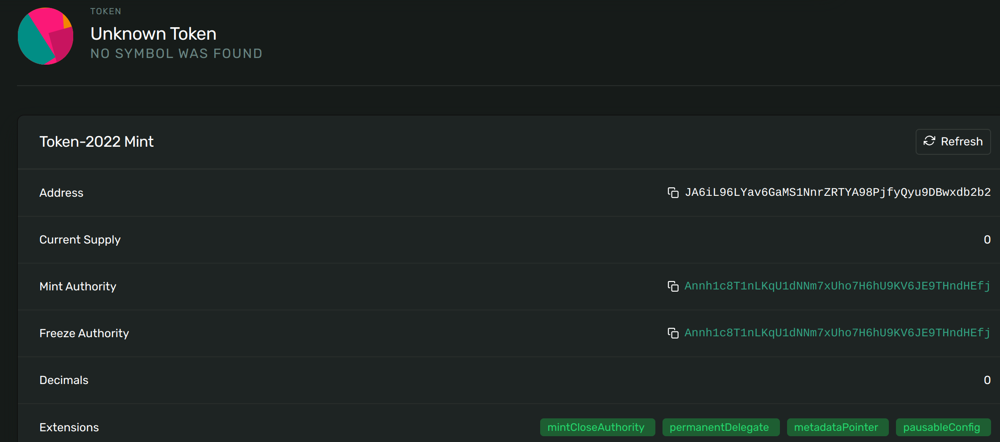


##### Verification

```bash
spl-token display [OPTIONS] <TOKEN_ADDRESS>
```

```bash
spl-token display $TOKEN_MINT
```

**Result**

> SPL Token Mint
>      Address: JA6iL96LYav6GaMS1NnrZRTYA98PjfyQyu9DBwxdb2b2
>      Program: TokenzQdBNbLqP5VEhdkAS6EPFLC1PHnBqCXEpPxuEb
>      Supply: 0
>      Decimals: 0
>      Mint authority: Annh1c8T1nLKqU1dNNm7xUho7H6hU9KV6JE9THndHEfj
>      Freeze authority: Annh1c8T1nLKqU1dNNm7xUho7H6hU9KV6JE9THndHEfj
> Extensions
>      Close authority: Annh1c8T1nLKqU1dNNm7xUho7H6hU9KV6JE9THndHEfj
>      Permanent delegate: Annh1c8T1nLKqU1dNNm7xUho7H6hU9KV6JE9THndHEfj
>      Metadata Pointer:
>        Authority: Annh1c8T1nLKqU1dNNm7xUho7H6hU9KV6JE9THndHEfj
>        Metadata address: JA6iL96LYav6GaMS1NnrZRTYA98PjfyQyu9DBwxdb2b2

------

### Initialize On-Chain Metadata

```bash
spl-token initialize-metadata --url <url> \ --program-2022 --mint-authority <Solana Keypair> \ --update-authority <Solana Keypair> <name> <symbol> <Token URI>
```

**Note**

- The CMTA specification only includes the token name, symbol and the terms uri (if relevant)
- Terms uri: Reference to any legally required documentation about the distributed ledger or the smart contract, such as the tokenization terms, the terms of the instrument and other relevant documents (e.g. prospectus or key information document).
- Token-2022 Metadata Structure. See [Token metadata](https://github.com/solana-program/token-metadata/tree/main/interface) 

| **Field**             | **Type**                | **Description**                                              | **Example**                  |
| :-------------------- | :---------------------- | :----------------------------------------------------------- | :--------------------------- |
| `update_authority`    | `OptionalNonZeroPubkey` | Public key allowed to update metadata. If unset, metadata is immutable. | `7gH…kP1`                    |
| `mint`                | `Pubkey`                | The mint address this metadata belongs to (prevents spoofing). | `<address>`                  |
| `name`                | `String`                | Human-readable name of the token.                            | `CMTAT Token`                |
| `symbol`              | `String`                | Short token symbol (≤10 chars).                              | `CMTAT`                      |
| `uri`                 | `String`                | URI pointing to extended metadata or compliance docs (e.g. JSON file, website). | `https://cmta.ch/token.json` |
| `additional_metadata` | `Vec<(String, String)>` | Flexible key–value pairs for extra fields such as compliance info, issuer, or terms hash. | `("termsHash","Qm123…")`     |

#### Example

```bash
spl-token initialize-metadata --program-2022 --mint-authority $ADMIN_SOLANA_KEYPAIR --update-authority $ADMIN_SOLANA_KEYPAIR $TOKEN_MINT CMTATToken CMTAT https://cmta.ch/token.json
```

 

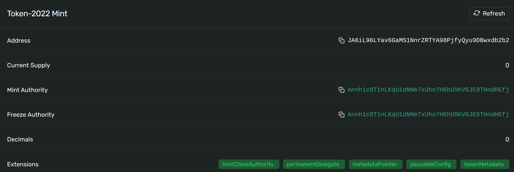


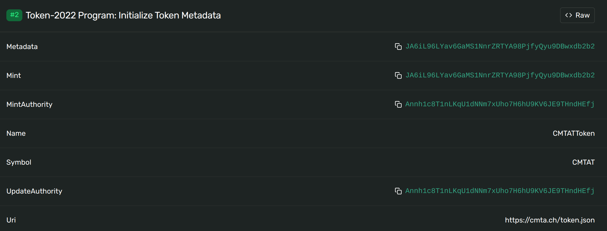


**Verification**

```bash
spl-token display $TOKEN_MINT
```

> SPL Token Mint
>      Address: JA6iL96LYav6GaMS1NnrZRTYA98PjfyQyu9DBwxdb2b2
>      Program: TokenzQdBNbLqP5VEhdkAS6EPFLC1PHnBqCXEpPxuEb
>      Supply: 0
>      Decimals: 0
>      Mint authority: Annh1c8T1nLKqU1dNNm7xUho7H6hU9KV6JE9THndHEfj
>      Freeze authority: Annh1c8T1nLKqU1dNNm7xUho7H6hU9KV6JE9THndHEfj
> Extensions
>      Close authority: Annh1c8T1nLKqU1dNNm7xUho7H6hU9KV6JE9THndHEfj
>      Permanent delegate: Annh1c8T1nLKqU1dNNm7xUho7H6hU9KV6JE9THndHEfj
>      Metadata Pointer:
>        Authority: Annh1c8T1nLKqU1dNNm7xUho7H6hU9KV6JE9THndHEfj
>        Metadata address: JA6iL96LYav6GaMS1NnrZRTYA98PjfyQyu9DBwxdb2b2
>      Metadata:
>        Update Authority: Annh1c8T1nLKqU1dNNm7xUho7H6hU9KV6JE9THndHEfj
>        Mint: JA6iL96LYav6GaMS1NnrZRTYA98PjfyQyu9DBwxdb2b2
>        Name: CMTATToken
>        Symbol: CMTAT
>        URI: https://cmta.ch/token.json

### Create Token Account

```bash
spl-token create-account [OPTIONS] <TOKEN_MINT_ADDRESS> [ACCOUNT_KEYPAIR]
```

**Options**

 --program-2022
            Use token extension program token 2022 with program id:
            TokenzQdBNbLqP5VEhdkAS6EPFLC1PHnBqCXEpPxuEb

--owner <OWNER_ADDRESS>
            Address of the primary authority controlling a mint or account. Defaults to the client
            keypair address.

#### Admin

Create the token account for the admin

```bash
spl-token create-account --program-2022 $TOKEN_MINT --owner $ADMIN_SOLANA_KEYPAIR
```


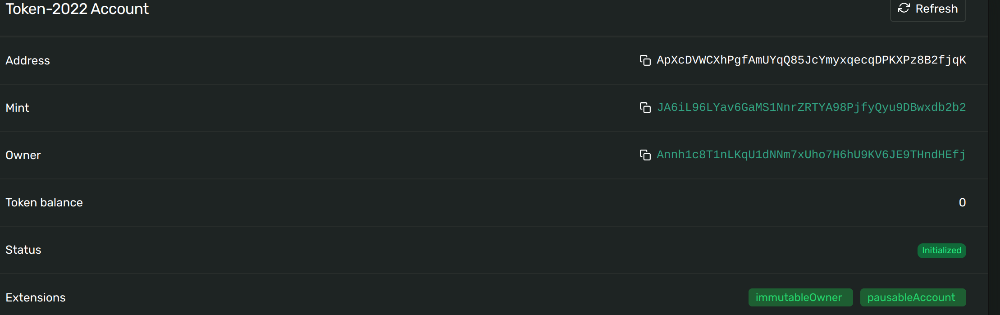

**Result**

> Creating account ApXcDVWCXhPgfAmUYqQ85JcYmyxqecqDPKXPz8B2fjqK

We export the token account created in an environment variable:

```bash
export ADMIN_TOKEN_ACCOUNT=ApXcDVWCXhPgfAmUYqQ85JcYmyxqecqDPKXPz8B2fjqK
```

#### User

Create a user token account

```bash
# Change default key to USER
solana config set -k $USER_SOLANA_KEYPAIR
# Create account
spl-token create-account --program-2022 $TOKEN_MINT --owner $USER_SOLANA_KEYPAIR
#rollback change
solana config set -k $ADMIN_SOLANA_KEYPAIR
```


Result:

> Creating account diZa8NKEJ7wTf31meXA9X2pyQnBsTnV4jsYUmwfFAK1

We export the token account created in an environment variable:

```bash
export USER_TOKEN_ACCOUNT=diZa8NKEJ7wTf31meXA9X2pyQnBsTnV4jsYUmwfFAK1
```


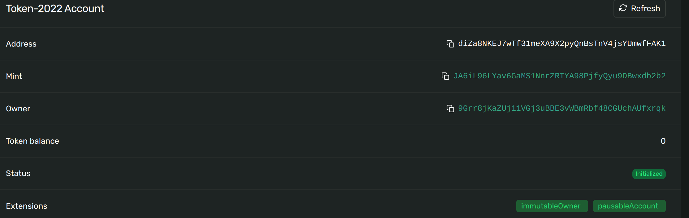


### Mint Initial Supply

```bash
spl-token mint [OPTIONS] <TOKEN_MINT_ADDRESS> <TOKEN_AMOUNT> [--]  [RECIPIENT_TOKEN_ACCOUNT_ADDRESS]
```

 Example

##### Admin

```bash
spl-token mint  --program-2022 --mint-authority $ADMIN_SOLANA_KEYPAIR $TOKEN_MINT 1000 $ADMIN_TOKEN_ACCOUNT
```

**Result**

> Minting 1000 tokens
>   Token: JA6iL96LYav6GaMS1NnrZRTYA98PjfyQyu9DBwxdb2b2
>   Recipient: ApXcDVWCXhPgfAmUYqQ85JcYmyxqecqDPKXPz8B2fjqK

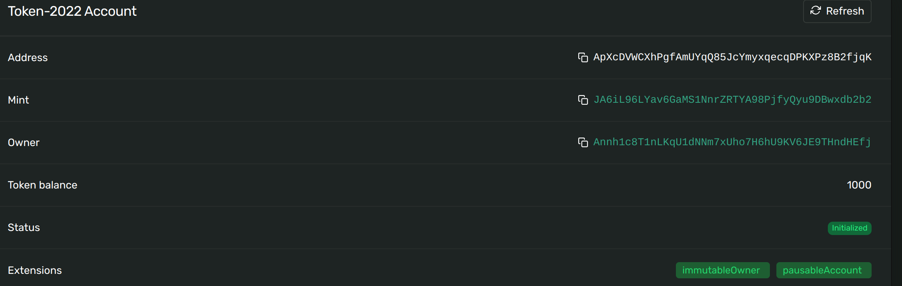


**Verification**

- Check the supply

```bash
spl-token supply $TOKEN_MINT
```

Result: `1000`

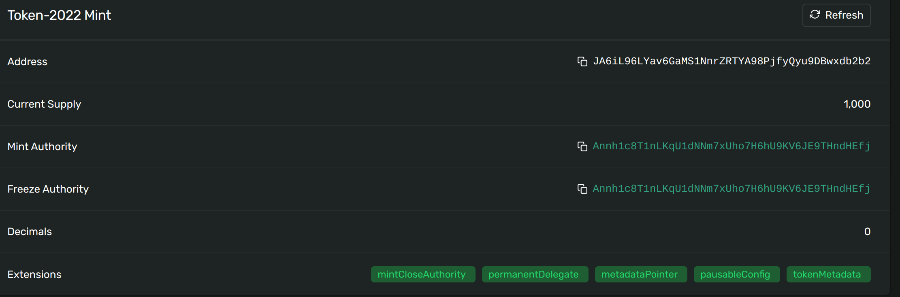

-  Check the token account balance

```bash
spl-token balance [OPTIONS] [TOKEN_MINT_ADDRESS]
```

```bash
spl-token balance --program-2022 --address $ADMIN_TOKEN_ACCOUNT
```

Result: `1000`

##### User

```bash
spl-token mint --program-2022 --mint-authority $ADMIN_SOLANA_KEYPAIR $TOKEN_MINT 300 $USER_TOKEN_ACCOUNT
```

**Result**

> Minting 300 tokens
>   Token: JA6iL96LYav6GaMS1NnrZRTYA98PjfyQyu9DBwxdb2b2
>   Recipient: diZa8NKEJ7wTf31meXA9X2pyQnBsTnV4jsYUmwfFAK1

```bash
spl-token balance --program-2022 --address $USER_TOKEN_ACCOUNT
```

Result: 300

```bash
spl-token supply $TOKEN_MINT
```

Result: 1300

 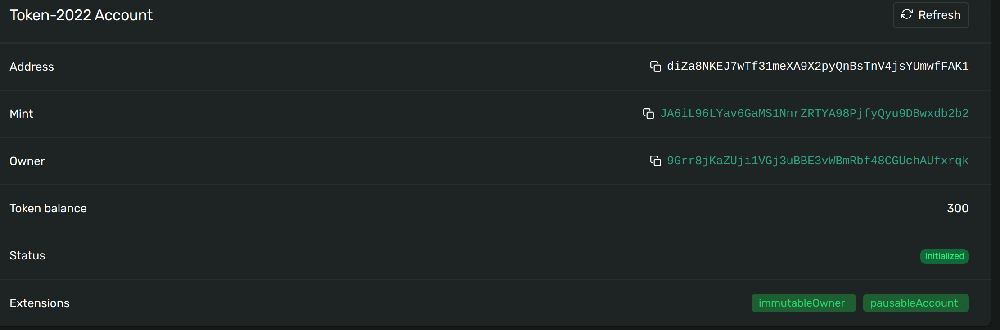


### Freeze / Unfreeze Accounts

The Mint may also contain a `freeze_authority` which can be used to issue `FreezeAccount` instructions that will render an Account unusable. 

- Token instructions that include a frozen account will fail until the Account is thawed using the `ThawAccount` instruction. 
- The `SetAuthority` instruction can be used to change a Mint's `freeze_authority`. 
- If a Mint's `freeze_authority` is set to `None` then account freezing and thawing is permanently disabled and all currently frozen accounts will also stay frozen permanently.

```bash
spl-token freeze [OPTIONS] <TOKEN_ACCOUNT_ADDRESS> 
spl-token thaw [OPTIONS] <TOKEN_ACCOUNT_ADDRESS>
```

##### Freeze

```bash
spl-token freeze --freeze-authority $ADMIN_SOLANA_KEYPAIR $USER_TOKEN_ACCOUNT
```

**Result**

> Freezing account: diZa8NKEJ7wTf31meXA9X2pyQnBsTnV4jsYUmwfFAK1
>   Token: JA6iL96LYav6GaMS1NnrZRTYA98PjfyQyu9DBwxdb2b2

- Instructions


- Account status

We can see that the status is passed to `Frozen`.

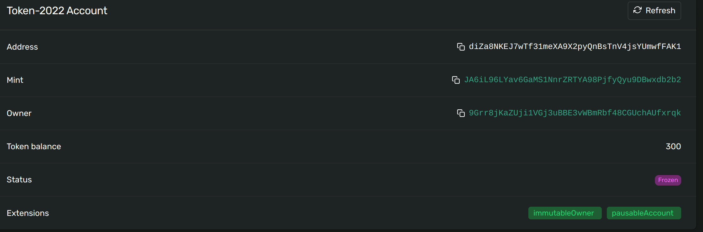

##### Transfer

```bash
spl-token transfer [OPTIONS] \ <TOKEN_MINT_ADDRESS> <TOKEN_AMOUNT> \ <RECIPIENT_WALLET_ADDRESS or RECIPIENT_TOKEN_ACCOUNT_ADDRESS>
```

 **Example**

We try to transfer tokens from our user account to the admin account

```bash
solana config set -k $USER_SOLANA_KEYPAIR
spl-token transfer --program-2022 --from $USER_TOKEN_ACCOUNT $TOKEN_MINT 100 $ADMIN_TOKEN_ACCOUNT
```

**Result**

> Transfer 100 tokens
>      Sender: diZa8NKEJ7wTf31meXA9X2pyQnBsTnV4jsYUmwfFAK1
>      Recipient: ApXcDVWCXhPgfAmUYqQ85JcYmyxqecqDPKXPz8B2fjqK
> Error: Client(Error { request: Some(SendTransaction), kind: RpcError(RpcResponseError { code: -32002, message: "**Transaction simulation failed**: Error processing Instruction 0: custom program error: 0x11", data: SendTransactionPreflightFailure(RpcSimulateTransactionResult { err: Some(InstructionError(0, Custom(17))), logs: Some(["Program TokenzQdBNbLqP5VEhdkAS6EPFLC1PHnBqCXEpPxuEb invoke [1]", "Program log: Instruction: TransferChecked", "Program log: Error: **Account is frozen**", "Program TokenzQdBNbLqP5VEhdkAS6EPFLC1PHnBqCXEpPxuEb consumed 1111 of 1111 compute units", "Program TokenzQdBNbLqP5VEhdkAS6EPFLC1PHnBqCXEpPxuEb failed: custom program error: 0x11"]), accounts: None, units_consumed: Some(1111), loaded_accounts_data_size: Some(684911), return_data: None, inner_instructions: None, replacement_blockhash: None }) }) })

#### Unfreeze (thaw)

```
spl-token thaw [OPTIONS] <TOKEN_ACCOUNT_ADDRESS>
```

```bash
solana config set -k $ADMIN_SOLANA_KEYPAIR
spl-token thaw --freeze-authority $ADMIN_SOLANA_KEYPAIR $USER_TOKEN_ACCOUNT
```

**Result**

> Thawing account: diZa8NKEJ7wTf31meXA9X2pyQnBsTnV4jsYUmwfFAK1
>      Token: JA6iL96LYav6GaMS1NnrZRTYA98PjfyQyu9DBwxdb2b2


Now we can perform our transfer:

```bash
solana config set -k $USER_SOLANA_KEYPAIR
spl-token transfer --from $USER_TOKEN_ACCOUNT --owner $USER_SOLANA_KEYPAIR $TOKEN_MINT 100 $ADMIN_TOKEN_ACCOUNT
```

**Result**

> Transfer 100 tokens
>     Sender: diZa8NKEJ7wTf31meXA9X2pyQnBsTnV4jsYUmwfFAK1
>     Recipient: ApXcDVWCXhPgfAmUYqQ85JcYmyxqecqDPKXPz8B2fjqK

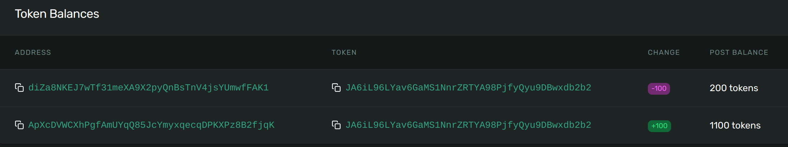

### Burn Tokens / Forced Transfer (Permanent Delegate)

The standard token version already allows a token holder to burn its own token

With Token-2022, it's possible to specify a permanent account delegate for a mint. This authority has unlimited delegate privileges over any account for that mint, meaning that it can burn or transfer any amount of tokens.

```bash
spl-token burn [OPTIONS] <TOKEN_ACCOUNT_ADDRESS> <TOKEN_AMOUNT>
```

```bash
spl-token burn $USER_TOKEN_ACCOUNT 5
```

> Burn 5 tokens
>   Source: diZa8NKEJ7wTf31meXA9X2pyQnBsTnV4jsYUmwfFAK1

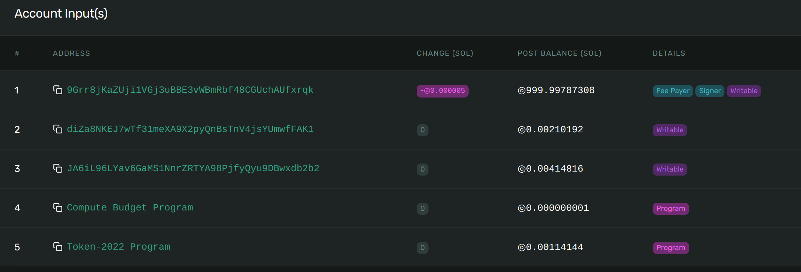

**Verification**

```bash
spl-token balance --program-2022 --address $USER_TOKEN_ACCOUNT
```

#### Burn as admin

```bash
solana config set -k $ADMIN_SOLANA_KEYPAIR
spl-token burn $USER_TOKEN_ACCOUNT 5
```

**Result**

> Burn 5 tokens
>     Source: diZa8NKEJ7wTf31meXA9X2pyQnBsTnV4jsYUmwfFAK1

The signer of the transaction will be the admin

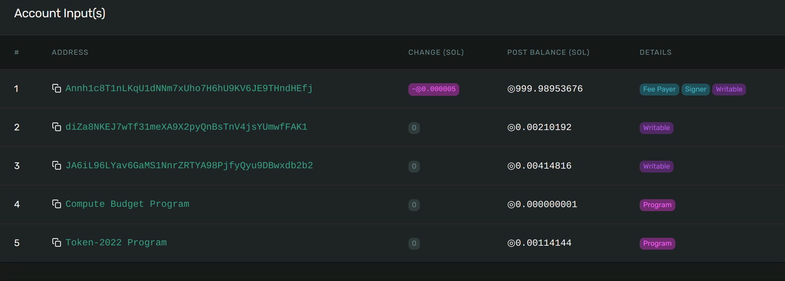


##### User as signer

If I try to burn admin tokens with my user as the signer, I will have the error `InvalidAccountForFee` because my user does not have the delegate authority.

```bash
# Change the signer in the config for the user solana config 
solana config set -k $USER_SOLANA_KEYPAIR
# try to burn admin token with the user as signer 
spl-token burn $ADMIN_TOKEN_ACCOUNT 5
```

**Result**

> Burn 5 tokens
>     Source: ApXcDVWCXhPgfAmUYqQ85JcYmyxqecqDPKXPz8B2fjqK
> Error: Client(Error { request: Some(SendTransaction), kind: RpcError(RpcResponseError { code: -32002, message: "Transaction simulation failed: Error processing Instruction 0: custom program error: 0x4", data: SendTransactionPreflightFailure(RpcSimulateTransactionResult { err: Some(InstructionError(0, Custom(4))), logs: Some(["Program TokenzQdBNbLqP5VEhdkAS6EPFLC1PHnBqCXEpPxuEb invoke [1]", "Program log: Instruction: BurnChecked", "Program log: **Error: owner does not match**", "Program TokenzQdBNbLqP5VEhdkAS6EPFLC1PHnBqCXEpPxuEb consumed 2013 of 2013 compute units", "Program TokenzQdBNbLqP5VEhdkAS6EPFLC1PHnBqCXEpPxuEb failed: custom program error: 0x4"]), accounts: None, units_consumed: Some(2013), loaded_accounts_data_size: Some(684673), return_data: None, inner_instructions: None, replacement_blockhash: None }) }) })

 

#### Forced transfer

A forced transfer is performed in the same way as a standard transfer

```bash
spl-token transfer [OPTIONS] <TOKEN_MINT_ADDRESS> \ <TOKEN_AMOUNT> \ <RECIPIENT_WALLET_ADDRESS or RECIPIENT_TOKEN_ACCOUNT_ADDRESS>
```

**Example**

```bash
# Change the signer in the config for the admin solana config 
solana config set -k $ADMIN_SOLANA_KEYPAIR
#  forced transfer tokens from user -> admin with the admin signer key 
spl-token transfer --program-2022 --from $USER_TOKEN_ACCOUNT $TOKEN_MINT 10 $ADMIN_TOKEN_ACCOUNT
```

 

**Result**

> Transfer 10 tokens
>   Sender: diZa8NKEJ7wTf31meXA9X2pyQnBsTnV4jsYUmwfFAK1
>   Recipient: ApXcDVWCXhPgfAmUYqQ85JcYmyxqecqDPKXPz8B2fjqK

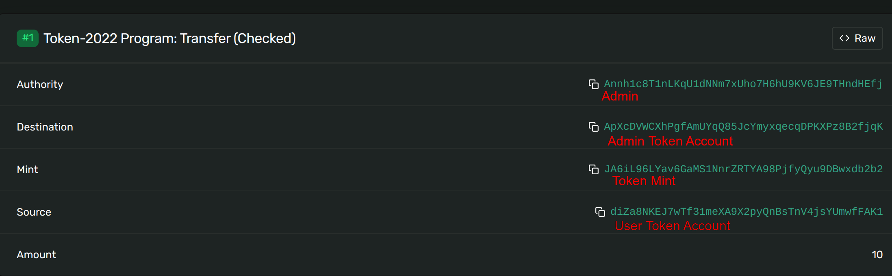

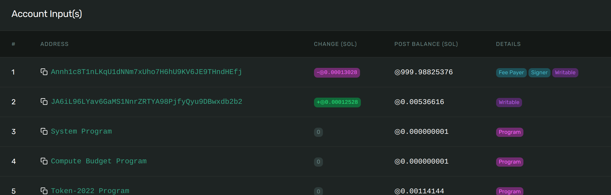


### Pause / Resume All Activity

By enabling the pausable extension on your mint, the program aborts all tranfers, mints, and burns when the `paused` flag is flipped.

This also includes force operation by the admin such as `burn`and `transfer`

####  Pause

Pause

```bash
spl-token pause [OPTIONS] <TOKEN_MINT_ADDRESS>
spl-token pause $TOKEN_MINT
```

**Result**

Pausing mint, burn, and transfer for JA6iL96LYav6GaMS1NnrZRTYA98PjfyQyu9DBwxdb2b2

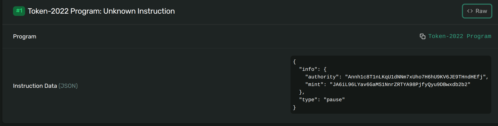


Trying a transfer will generate *Program log: Transferring, minting, and burning is paused on this mint*

```bash
solana config set -k $ADMIN_SOLANA_KEYPAIR
spl-token transfer $TOKEN_MINT 10 $USER_TOKEN_ACCOUNT 
```

> Transfer 10 tokens
>   Sender: ApXcDVWCXhPgfAmUYqQ85JcYmyxqecqDPKXPz8B2fjqK
>   Recipient: diZa8NKEJ7wTf31meXA9X2pyQnBsTnV4jsYUmwfFAK1
> Error: Client(Error { request: Some(SendTransaction), kind: RpcError(RpcResponseError { code: -32002, message: "Transaction simulation failed: Error processing Instruction 0: custom program error: 0x43", data: SendTransactionPreflightFailure(RpcSimulateTransactionResult { err: Some(InstructionError(0, Custom(67))), logs: Some(["Program TokenzQdBNbLqP5VEhdkAS6EPFLC1PHnBqCXEpPxuEb invoke [1]", "Program log: Instruction: TransferChecked", "**Program log: Transferring, minting, and burning is paused on this mint**", "Program TokenzQdBNbLqP5VEhdkAS6EPFLC1PHnBqCXEpPxuEb consumed 2192 of 2192 compute units", "Program TokenzQdBNbLqP5VEhdkAS6EPFLC1PHnBqCXEpPxuEb failed: custom program error: 0x43"]), accounts: None, units_consumed: Some(2192), loaded_accounts_data_size: Some(684911), return_data: None, inner_instructions: None, replacement_blockhash: None }) }) })

------

#### Resume

Resume mint, burn, and transfer

```
spl-token resume [OPTIONS] <TOKEN_MINT_ADDRESS>
spl-token resume $TOKEN_MINT
```

 Resuming mint, burn, and transfer for JA6iL96LYav6GaMS1NnrZRTYA98PjfyQyu9DBwxdb2b2

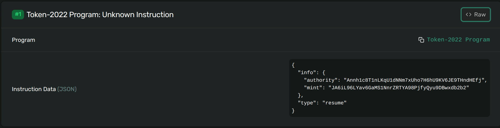

------

### Update On-Chain Metadata

To facilitate token-metadata usage, Token-2022 allows a mint creator to include their token's metadata directly in the mint account.

```bash
spl-token update-metadata <TOKEN_MINT_ADDRESS> <FIELD_NAME>
```

 **Example**

```bash
# Update name, symbol, or URI spl-token update-metadata $TOKEN_MINT name "New CMTAT Token" 
spl-token update-metadata $TOKEN_MINT symbol "NEW" 
spl-token update-metadata $TOKEN_MINT uri "https://cmta.ch/token_new.json"  
# Add custom compliance fields 
spl-token update-metadata $TOKEN_MINT TermsUri "https://cmta.ch/token_new.pdf" 
spl-token update-metadata $TOKEN_MINT termsHash "0x9c22ff5f21f0b81b113e63f7db6da94fedef11b2119b4088b89664fb9a3cb658" 
spl-token update-metadata $TOKEN_MINT jurisdiction "EU-MiCA" 
spl-token update-metadata $TOKEN_MINT issuer "CMTA" 
```

**Result**

```bash
spl-token display $TOKEN_MINT
```

> spl-token display $TOKEN_MINT

> SPL Token Mint
>   Address: JA6iL96LYav6GaMS1NnrZRTYA98PjfyQyu9DBwxdb2b2
>   Program: TokenzQdBNbLqP5VEhdkAS6EPFLC1PHnBqCXEpPxuEb
>   Supply: 1270
>   Decimals: 0
>   Mint authority: Annh1c8T1nLKqU1dNNm7xUho7H6hU9KV6JE9THndHEfj
>   Freeze authority: Annh1c8T1nLKqU1dNNm7xUho7H6hU9KV6JE9THndHEfj
> Extensions
>   Close authority: Annh1c8T1nLKqU1dNNm7xUho7H6hU9KV6JE9THndHEfj
>   Permanent delegate: Annh1c8T1nLKqU1dNNm7xUho7H6hU9KV6JE9THndHEfj
>   Metadata Pointer:
>     Authority: Annh1c8T1nLKqU1dNNm7xUho7H6hU9KV6JE9THndHEfj
>     Metadata address: JA6iL96LYav6GaMS1NnrZRTYA98PjfyQyu9DBwxdb2b2
>   Metadata:
>     Update Authority: Annh1c8T1nLKqU1dNNm7xUho7H6hU9KV6JE9THndHEfj
>     Mint: JA6iL96LYav6GaMS1NnrZRTYA98PjfyQyu9DBwxdb2b2
>     Name: CMTATToken
>     Symbol: NEW
>     URI: https://cmta.ch/token_new.json
>     TermsUri: https://cmta.ch/token_new.pdf
>     termsHash: 0x9c22ff5f21f0b81b113e63f7db6da94fedef11b2119b4088b89664fb9a3cb658
>     jurisdiction: EU-MiCA
>     issuer: CMTA

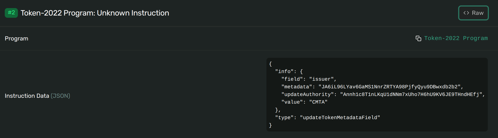

#### Remove a custom field

```bash
spl-token update-metadata $TOKEN_MINT termsHash --remove
```

**Result**

```bash
spl-token display $TOKEN_MINT
```

> SPL Token Mint
>   Address: JA6iL96LYav6GaMS1NnrZRTYA98PjfyQyu9DBwxdb2b2
>   Program: TokenzQdBNbLqP5VEhdkAS6EPFLC1PHnBqCXEpPxuEb
>   Supply: 1270
>   Decimals: 0
>   Mint authority: Annh1c8T1nLKqU1dNNm7xUho7H6hU9KV6JE9THndHEfj
>   Freeze authority: Annh1c8T1nLKqU1dNNm7xUho7H6hU9KV6JE9THndHEfj
> Extensions
>   Close authority: Annh1c8T1nLKqU1dNNm7xUho7H6hU9KV6JE9THndHEfj
>   Permanent delegate: Annh1c8T1nLKqU1dNNm7xUho7H6hU9KV6JE9THndHEfj
>   Metadata Pointer:
>     Authority: Annh1c8T1nLKqU1dNNm7xUho7H6hU9KV6JE9THndHEfj
>     Metadata address: JA6iL96LYav6GaMS1NnrZRTYA98PjfyQyu9DBwxdb2b2
>   Metadata:
>     Update Authority: Annh1c8T1nLKqU1dNNm7xUho7H6hU9KV6JE9THndHEfj
>     Mint: JA6iL96LYav6GaMS1NnrZRTYA98PjfyQyu9DBwxdb2b2
>     Name: CMTATToken
>     Symbol: NEW
>     URI: https://cmta.ch/token_new.json
>     TermsUri: https://cmta.ch/token_new.pdf
>     jurisdiction: EU-MiCA
>     issuer: CMTA


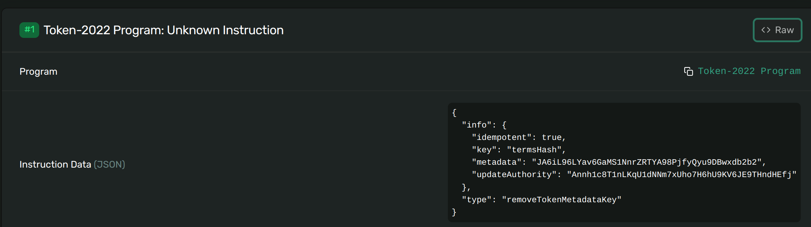

### Deactivate token

#### Burn all tokens

Using the delegate authorities, burn all remaining tokens as seen above.

```bash
spl-token balance --address $USER_TOKEN_ACCOUNT
```

Result: 150

```bash
spl-token burn $USER_TOKEN_ACCOUNT 150
```

> Burn 150 tokens

```
spl-token balance --address $ADMIN_TOKEN_ACCOUNT
```

Result: 1120

```bash
spl-token burn $ADMIN_TOKEN_ACCOUNT 1120
```

```bash
spl-token supply $TOKEN_MINT
```

Result: 0

#### Deactivate Authorities

Then you can optionally deactivate all authorities, except the `MintCloseAuthority`

```bash
spl-token authorize [OPTIONS] <TOKEN_ADDRESS> <AUTHORITY_TYPE> [--] [AUTHORITY_ADDRESS]
```

**Example**

```bash
spl-token authorize $TOKEN_MINT mint --disable 
spl-token authorize $TOKEN_MINT freeze --disable 
spl-token authorize $TOKEN_MINT pause --disable
```

**Result**

> Updating JA6iL96LYav6GaMS1NnrZRTYA98PjfyQyu9DBwxdb2b2
>     Current mint: Annh1c8T1nLKqU1dNNm7xUho7H6hU9KV6JE9THndHEfj
>     New mint: disabled
>
>  Updating JA6iL96LYav6GaMS1NnrZRTYA98PjfyQyu9DBwxdb2b2
>  Current freeze: Annh1c8T1nLKqU1dNNm7xUho7H6hU9KV6JE9THndHEfj
>   New freeze: disabled
>   
>   Updating JA6iL96LYav6GaMS1NnrZRTYA98PjfyQyu9DBwxdb2b2
>  Current pause: Annh1c8T1nLKqU1dNNm7xUho7H6hU9KV6JE9THndHEfj
>   New pause: disabled

 

#### Close the Mint

The Token program allows owners to close token accounts, but it is impossible to close mint accounts. In Token-2022, it is possible to close mints by initializing the `MintCloseAuthority` extension before initializing the mint.

The Admin must burn all tokens before closing the token mint

```bash
spl-token close-mint $TOKEN_MINT
```

If you try to mint new tokens:

```bash
spl-token mint --program-2022 --mint-authority $ADMIN_SOLANA_KEYPAIR $TOKEN_MINT 300 $USER_TOKEN_ACCOUNT
```

This will generate the following error:

> Error: "Account JA6iL96LYav6GaMS1NnrZRTYA98PjfyQyu9DBwxdb2b2 not found"


## CMAT with whitelist

CMTAT Solidity version allows to restrict transactions to a predefined list of approved wallet addresses, known as a **whitelist/allowlist**. This is done through a specific deployment version (`CMTAT Allowlist`) or through the RuleEngine (e.g. `RuleWhitelist`) .

With Solana, this is done by enabling the extension `Default Account State` at the creation of the token.

### Command line

With the command-line, this is done by using the following option `--default-account-state` with the argument `initialized`or `frozen`.

```bash
spl-token create-token \  --program-id TokenzQdBNbLqP5VEhdkAS6EPFLC1PHnBqCXEpPxuEb \  --decimals  <decimals>\  --mint-authority < Solana Keypair> \  --enable-permanent-delegate \  --enable-pause \  --enable-close \  --enable-metadata  --enable-freeze --default-account-state frozen
```

- With `initialized`, the frozen status by default is not enabled for the moment, but can be enabled later by the authorized authority.

- With `frozen`,  all accounts are frozen by default and required to be unfrozen to allow to be a token holder.

Over time, if the mint creator decides to relax this restriction, the freeze authority may sign an `update_default_account_state` instruction to make all accounts unfrozen by default.

```bash
spl-token update-default-account-state [OPTIONS] <TOKEN_MINT_ADDRESS> <STATE>
```

### Example

| Label         | Value                                          |
| ------------- | ---------------------------------------------- |
| Admin address | `9G3BN5Jeemo5nQbtPNhcKyeyitHQZ3kti8ARYYD7yEQp` |
| User address  | `DcDkMbpHDSUGXwFroZgE6chGPXFjcL4qr1YReViaMmrL` |


#### Create token mint

**Command**

```bash
spl-token create-token --program-id TokenzQdBNbLqP5VEhdkAS6EPFLC1PHnBqCXEpPxuEb   --decimals 0 --mint-authority $ADMIN_SOLANA_KEYPAIR --enable-permanent-delegate   --enable-pause --enable-close --enable-metadata --enable-freeze --default-account-state frozen
```

**Result**

> Creating token AJCDqXP16eJByoZ8gNono6Lm8VZaPHsBganJci1CF5tQ under program TokenzQdBNbLqP5VEhdkAS6EPFLC1PHnBqCXEpPxuEb
> To initialize metadata inside the mint, please run `spl-token initialize-metadata AJCDqXP16eJByoZ8gNono6Lm8VZaPHsBganJci1CF5tQ <YOUR_TOKEN_NAME> <YOUR_TOKEN_SYMBOL> <YOUR_TOKEN_URI>`, and sign with the mint authority.
>
> Address:  AJCDqXP16eJByoZ8gNono6Lm8VZaPHsBganJci1CF5tQ
> Decimals:  0


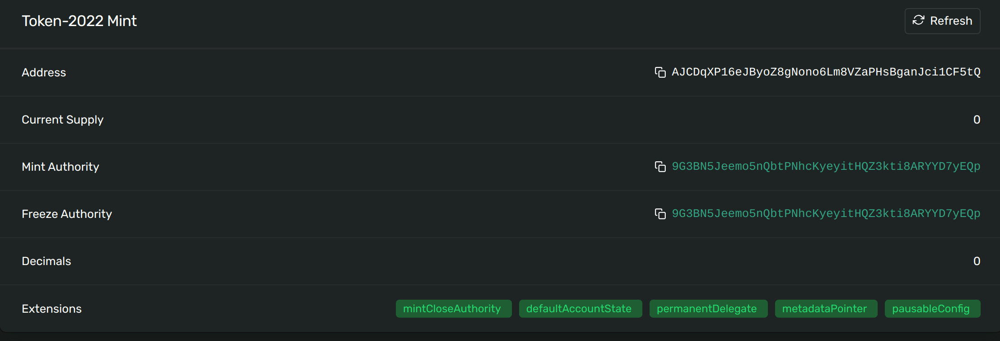

In the explorer, we can see that our token mint has the extension `defaultAccountState`

We export our token address in our bash environment

```bash
export TOKEN_MINT=AJCDqXP16eJByoZ8gNono6Lm8VZaPHsBganJci1CF5tQ
```

#### Create token account

We create then the token account for the admin

```bash
spl-token create-account --program-2022 $TOKEN_MINT --owner $ADMIN_SOLANA_KEYPAIR
```

> Creating account DRFWi78CJhhcfca9yZCTZbaBjnsTWhiP2yLiu6oVmrxG

##### Instruction details

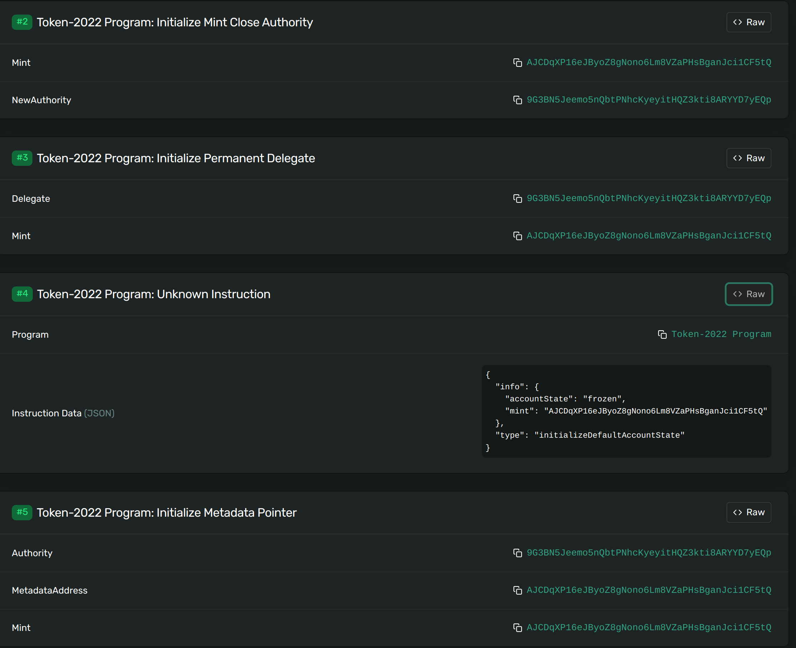

##### Account status

We can see that the status is `frozen`

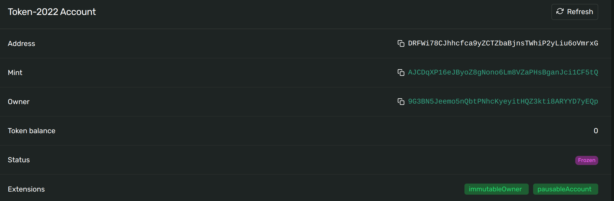

We export the token account address

```bash
export ADMIN_TOKEN_ACCOUNT=DRFWi78CJhhcfca9yZCTZbaBjnsTWhiP2yLiu6oVmrxG
```


#### Thaw / unfreeze token account

```bash
solana config set -k $ADMIN_SOLANA_KEYPAIR
spl-token thaw --freeze-authority $ADMIN_SOLANA_KEYPAIR $ADMIN_TOKEN_ACCOUNT
```

>  Thawing account: DRFWi78CJhhcfca9yZCTZbaBjnsTWhiP2yLiu6oVmrxG
>   Token: AJCDqXP16eJByoZ8gNono6Lm8VZaPHsBganJci1CF5tQ

##### New status

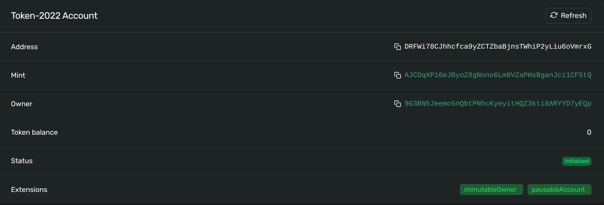


#### Update token mint

```bash
spl-token update-default-account-state $TOKEN_MINT initialized
```

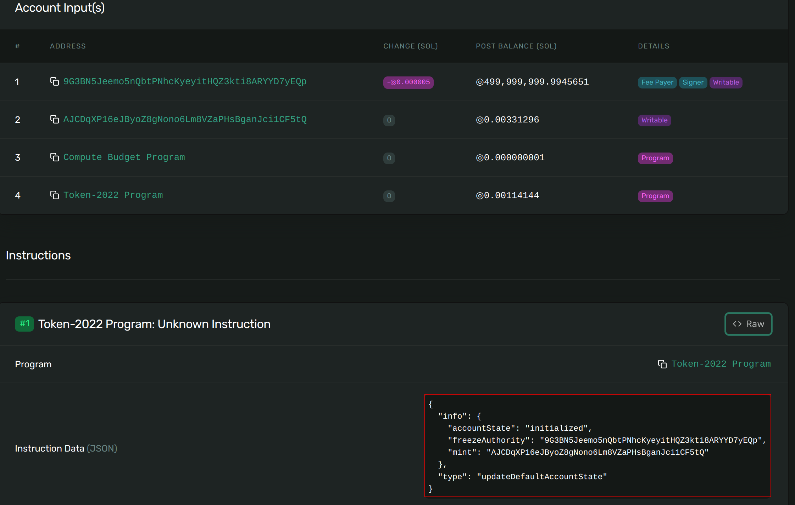


#### Create token account

```bash
solana config set -k $ADMIN_SOLANA_KEYPAIR
spl-token create-account --program-2022 $TOKEN_MINT --owner $USER_SOLANA_KEYPAIR
```

> Creating account 4SKEr1QXpy9H5KV8voAM1FjzPoxAjs26WfenkgPXdq7E

We can see in the explorer that the status of the new created account is `initialized`instead of `frozen`

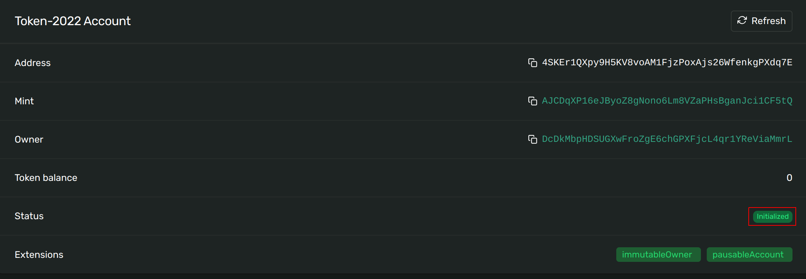


## Reference

- [Token](https://www.solana-program.com/docs/token) 

- [Solana Program - Token-2022](https://www.solana-program.com/docs/token-2022) 

- [Solana - Getting Started with Token Extensions](https://solana.com/developers/guides/token-extensions/getting-started) 

- [Solana Program - Extension Guide](https://www.solana-program.com/docs/token-2022/extensions#permanent-delegate) 

- [Solana - Issuing Tokenized Equities on Solana Report](https://solana.com/tokenized-equities)

  
